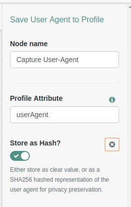

<b>Save User Agent to Profile Authentication Node</b>
 
A simple authentication node that stores a SHA256 hash of the requesting user-agent address to the users profile.
 
 
<b>Installation</b>
 
Copy the .jar file from the ../target directory into the ../web-container/webapps/openam/WEB-INF/lib directory where AM is deployed.  Restart the web container to pick up the new node.  The node will then appear in the authentication trees components palette.
 
 
<b>Usage</b>
 
Deploy the node, and select which attribute you want to use to store the user agent (making sure this is available in the profile schema).
 
 
<b>To Build</b>
 
To rebuild, run "mvn clean install" in the directory containing the pom.xml
 
 
 

 
 
<b>Disclaimer</b>
The sample code described herein is provided on an "as is" basis, without warranty of any kind, to the fullest extent permitted by law. ForgeRock does not warrant or guarantee the individual success developers may have in implementing the sample code on their development platforms or in production configurations.

ForgeRock does not warrant, guarantee or make any representations regarding the use, results of use, accuracy, timeliness or completeness of any data or information relating to the sample code. ForgeRock disclaims all warranties, expressed or implied, and in particular, disclaims all warranties of merchantability, and warranties related to the code, or any service or software related thereto.

ForgeRock shall not be liable for any direct, indirect or consequential damages or costs of any type arising out of any action taken by you or others related to the sample code.